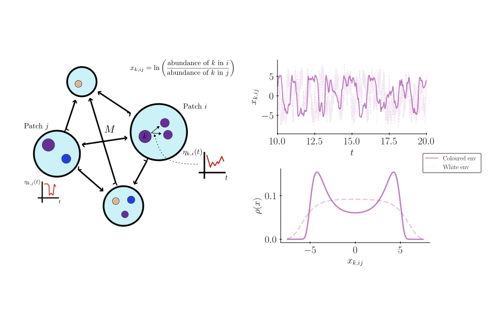

# Fluctuating environments are sufficient to drive substantial variability in species abundance across locations

This repository contains the relevant source code for the manuscript "Fluctuating environments are sufficient to drive substantial variability in species abundance across locations"

Allowing for the reproduction of statistical analyses and numerical results reported.

## Installation requirements

A local package which contains source code required for generating analysis figures may be installed via the command line by running:

`pip install .`

This should also install all other required python packages needed to reproduce the manuscript figures.

## License

The source code is freely available under an MIT license. The plots are licensed under a Creative Commons attributions license (CC-BY).

